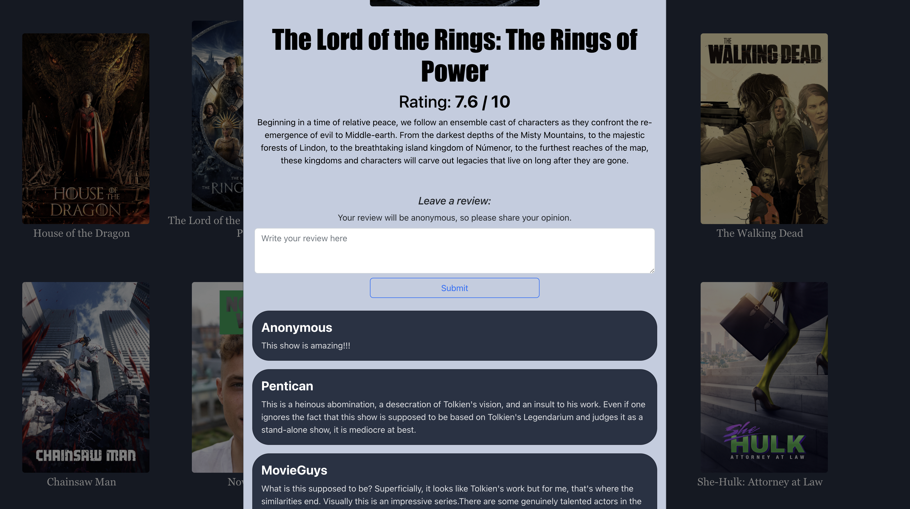
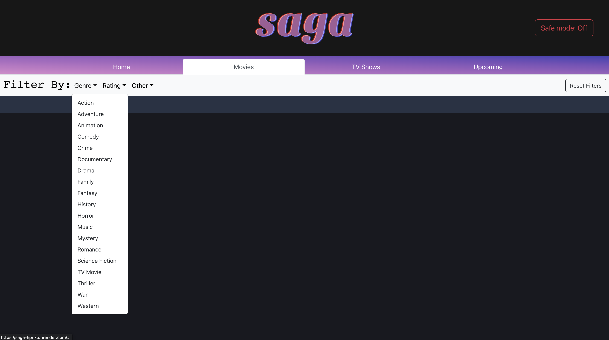
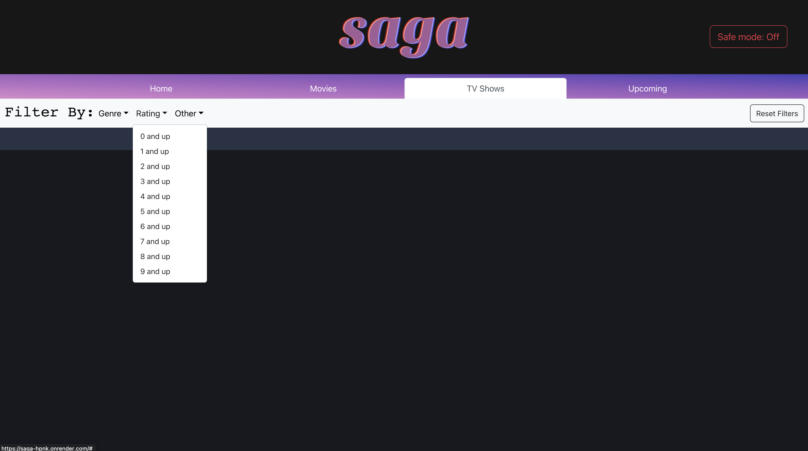
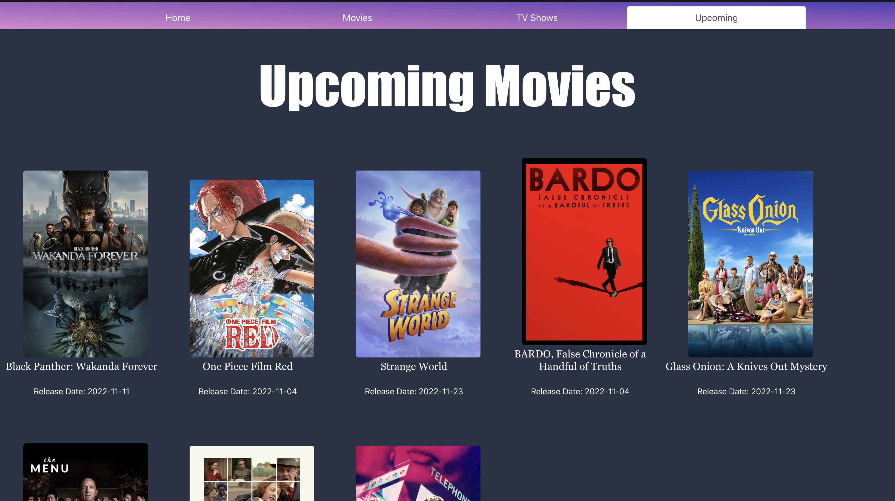
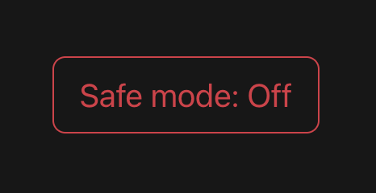

<p align="center">
  
</p>

# <div align="center">A platform for reviewing your favorite movies and shows</div>

## Table of Contents
- [Introduction](#introduction)
- [Features](#features)
- [Getting Started](#getting-started)
    - [Setup](#setup)
    - [How to set up knexfile](#how-to-set-up-knexfile)
- [Explanation of application (with images)](#explanation-of-application-with-images)
- [Contributors](#contributors)

# Introduction  
[saga](https://saga-hpnk.onrender.com/) is an application designed to give users one location to find popular movies and tv shows and leave their own reviews. Our application uses data from TMDB to provide details about past and upcoming movies and shows. We hope you enjoy using saga.  
<br>
[saga](https://saga-hpnk.onrender.com/) uses javascript with react and react-bootstrap to render responsive UI/UX and runs a node.js server and a postgresql database.  

# Features
* Uses TMDB api to ensure only the latest data is displayed
* Displays most popular movies and shows on the homepage
* Filters through movies and shows by genre, ratings, and other filters
* Displays upcoming films and release dates
* Finds data pertaining to ratings and reviews of the movies and shows
* Allows users to add their own reviews to the existing review collections.
* Provides a safe mode switch which only shows movies that are not marked with adult content

# Getting Started  
### ‼️ Things you will need:
* Install [postgresql](https://www.postgresql.org/)
* Get api key from [TMDB](https://www.themoviedb.org/documentation/api)

# Setup
Begin by running the following command in the root folder to install depencies  
```
npm install
```  
Next, create a postgresql database  
```
psql
CREATE DATABASE <db_name>
```  
After your database is created and running, run the following commands to create database and add seed data  
```
npm run migrate:latest
npm run seed:data
```  
To start the server, run the following command  
```
npm start
```  
Next run the following commands to change directory to ```./frontend``` and install npm dependencies for react  
```
cd frontend
npm install
```  
Finally, to start the react app run the following command in ```./frontend```  
```
npm start
```  
# How to set up knexfile  
```knexfile.js``` can be find at the following path from the root folder: ```./backend/db```  

You will need to set up a ```.local.env``` file in the root folder which contains the following variables:  
```
API_KEY_TMDB=<your_api_key>
DB_USER=<your_db_username>
DB_NAME=<your_db_name>
DB_PASSWORD=<your_db_password>
NODE_ENV=development
```  
You will also want to add your ```.local.env``` to the ```.gitignore``` file in the root folder to avoid your sensitive data from being pushed to github 😱  
# Explanation of application (with images)

### Homepage
Users are initially shown a carousel of the top 5 movies currently. Users can scroll through the movies to view posters, ratings, descriptions, and can click a button to see more details, reviews, and leave a review.

<hr>

### Popular movies
Below the carousel on the homepage, users can view other popular movies. Clicking on a movie poster or title will open a popup window to read and share reviews.

<hr>

### Popular TV shows
Below the popular movies on the homepage, popular tv shows are also listed. As with the movies, clicking on the posters or titles are an easy way for users to read more details about the movie, reviews, and write their own reviews.

<hr>

### Movie/Show details popup
Upon clicking a poster, title, or details button, this popup window is dislayed with information about the selected content. 

<hr>

### Reviews
Users are able to write their own reviews of the movies and submit this to be rendered in our reviews list. Saga uses TMDB to generate reviews, and user reviews are added to our saga database to be viewed by other users.

<hr>

### Filter by genre
Under the movies or tv shows tabs, users can filter results based on genres. Selecting a genre will fill the page with the content filtered by their choice.

<hr>

### Filter by rating
You can also filter by rating to receive movies and shows that only rank higher than the selected rating. Both of these filters are compounded, so you can select a genre, rating, and a sorting filter under the other tab. To clear these filter results, users can click on the reset filters button.

<hr>

### Upcoming movies
Under the upcoming movies tab, users can view movies that have not been released yet. Users are able to click on the images or titles to view current information, as well as easily view the current release date for that movie.

<hr>

### Safe Mode
Saga provides users a way to moderate the content they are viewing. With the safe mode switch set to off, we do not filter any of the content going to the page. However, if a user wishes to view movies that are considered more age approprite (G, PG, PG-13, using the American movie rating system), they can simply toggle this switch on and click to a new tab and it will only show content within the appropriate rating range.<br>


<hr>

# Contributors
Feel free to check out our github pages and see what other projects we have worked on! 😎
<table>
  <tr>
    <td align="center"><a href="https://github.com/brian-walvoord"><br /><sub><b>Brian Walvoord</b></sub></a></td>
    <td align="center"><a href="https://github.com/Takahiro9-Murakami9"><br /><sub><b>Yousef</b></sub></a></td>
    <td align="center"><a href="https://github.com/YJK-7"><br /><sub><b>Yoon Ju</b></sub></a></td>
    <td align="center"><a href="https://github.com/calss0t"><br /><sub><b>Pol Texido</b></sub></a></td>
    <td align="center"><a href="https://github.com/yukicodes"><br /><sub><b>Yuki Kamoshita</b></sub></a></td>
  </tr>
</table>
